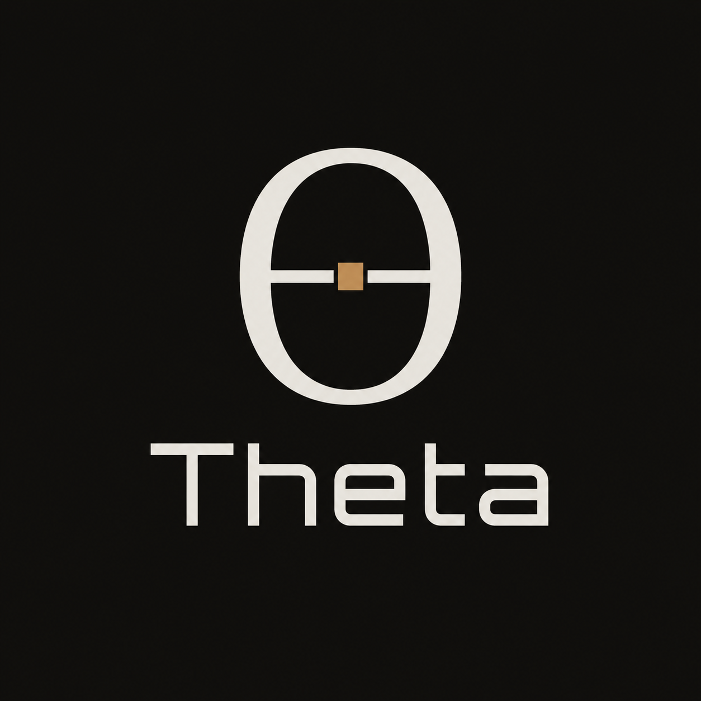

<div align="center">

  

  <h3>Theta</h3>

  A UCI chess engine focused on search strength, tactical precision, and
  reproducible engine testing.

</div>

## Overview

Theta is a C++17 chess engine that can be used from any chess GUI supporting the
[UCI protocol](https://backscattering.de/chess/uci/). It searches chess
positions, reports principal variations, evaluates positions, and selects a best
move under depth, node, movetime, or clock-based limits.

The engine is built around a classical chess-programming stack:

- Legal move generation, FEN parsing, make/undo, and Zobrist keys
- Iterative deepening, principal variation search, aspiration windows, and
  quiescence search
- Transposition tables with configurable hash size and clear-hash support
- Null-move pruning, late-move reductions, reverse futility pruning, ProbCut,
  singular extensions, and mate-distance pruning
- Staged move ordering with transposition-table moves, SEE/capture history,
  killer moves, quiet history, countermoves, and continuation history
- Classical evaluation terms for material, piece-square tables, mobility, king
  safety, pawn structure, passed pawns, threats, space, and piece activity
- Deterministic benchmarking, tactical checks, UCI protocol tests, and
  Cute Chess match scripts

Theta tests its strength against Stockfish 18 at limited strength settings. See [BENCHMARK_BASELINE.md](BENCHMARK_BASELINE.md) for more details.

## Building

Theta currently builds on Windows with `g++` available in `PATH`.

```cmd
build.cmd
```

Build modes:

```cmd
build.cmd debug
build.cmd release
build.cmd native
```

The build script compiles and runs the unit tests first, then writes the engine
binary to:

```text
build\theta.exe
```

`release` enables optimization and link-time optimization. `native` additionally
uses `-march=native` for the local CPU.

## Running Theta

Start the engine in UCI mode:

```cmd
build\theta.exe
```

Then connect it to a UCI-compatible GUI, or interact with it manually:

```text
uci
isready
position startpos
go depth 8
quit
```

Theta reports:

- `id name Theta`
- `id author FM`
- `Threads` option, currently fixed at `1`
- `Hash` option from `1` to `1024` MB
- `Clear Hash` button
- `Allow Draws` option

Supported search controls include depth, nodes, movetime, infinite search,
`stop`, and clock-based limits such as `wtime`, `btime`, `winc`, `binc`, and
`movestogo`.

## Command-Line Tools

Theta also includes small command-line helpers for development and testing.

Run the deterministic benchmark:

```cmd
build\theta.exe bench
```

Run the tactical suite:

```cmd
build\theta.exe tactics
```

List legal moves for a FEN as JSON:

```cmd
build\theta.exe moves "rnbqkbnr/pppppppp/8/8/8/8/PPPPPPPP/RNBQKBNR w KQkq - 0 1"
```

Print an evaluation trace for a FEN as JSON:

```cmd
build\theta.exe eval "rnbqkbnr/pppppppp/8/8/8/8/PPPPPPPP/RNBQKBNR w KQkq - 0 1"
```

Search a FEN to a fixed depth:

```cmd
build\theta.exe search 8 "rnbqkbnr/pppppppp/8/8/8/8/PPPPPPPP/RNBQKBNR w KQkq - 0 1"
```

Search with a depth and movetime limit in milliseconds:

```cmd
build\theta.exe search 12 1000 "rnbqkbnr/pppppppp/8/8/8/8/PPPPPPPP/RNBQKBNR w KQkq - 0 1"
```

## Testing

`build.cmd` runs the local test suite automatically. The current tests cover
position state, moves, move generation, FEN parsing, evaluation, search,
transposition tables, static exchange evaluation, and UCI protocol behavior.

For engine-vs-engine testing, the repository includes Cute Chess scripts:

```powershell
test\run-cutechess-selfplay.ps1
test\run-cutechess-match.ps1
```

Generated match artifacts are written under `test\results\` and are ignored by
Git.

## Configuration

Theta reads settings from [config/config.conf](config/config.conf).

Current options include:

- `max_depth`, the maximum accepted search depth
- `allow_draw`, which controls whether the engine is willing to choose drawing
  lines when alternatives exist

Multi-threaded search is not implemented yet; the UCI `Threads` option currently
reports a fixed single worker.

## Development Notes

Theta development favors measured strength changes. Search and evaluation work
should preserve correctness tests, pass the tactical suite, and be compared
against the deterministic benchmark before being kept. Larger strength changes
should be validated with engine matches when practical.